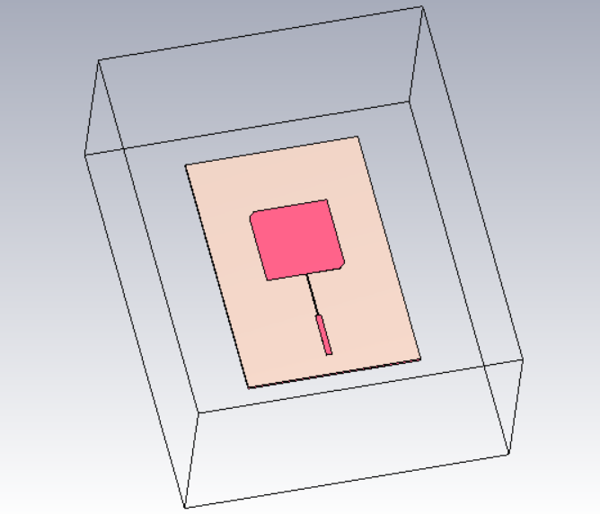
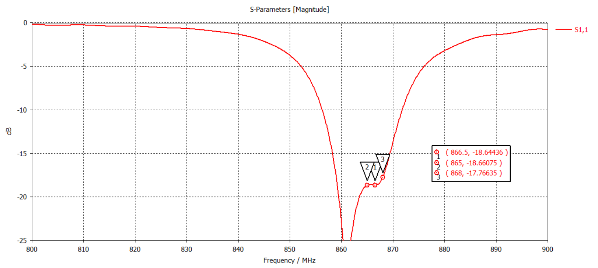
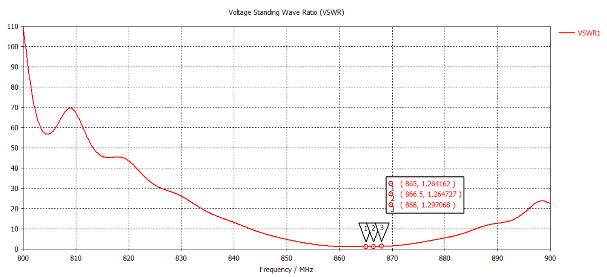
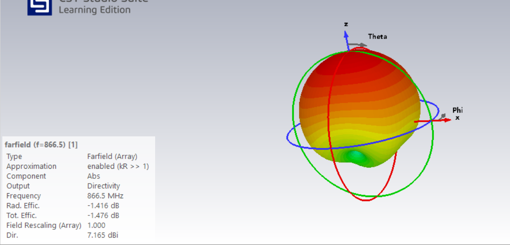
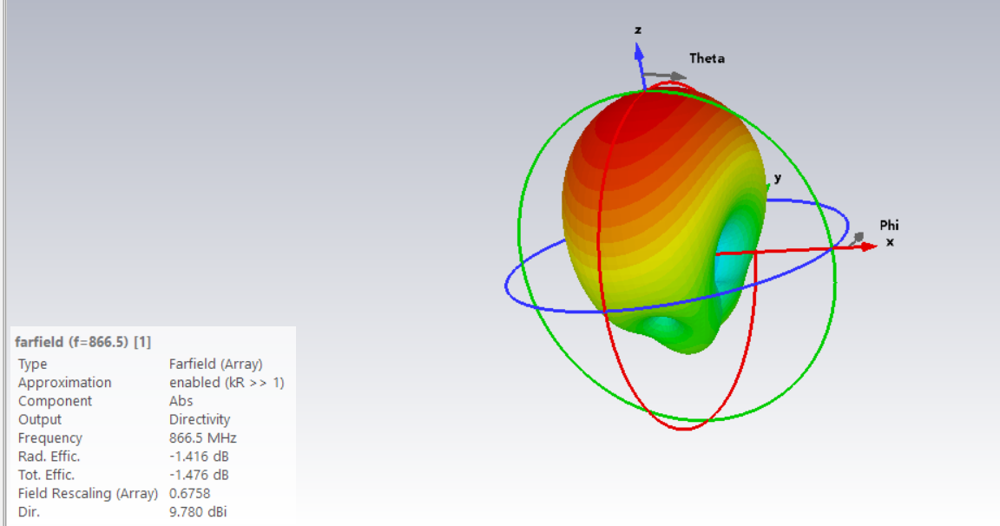
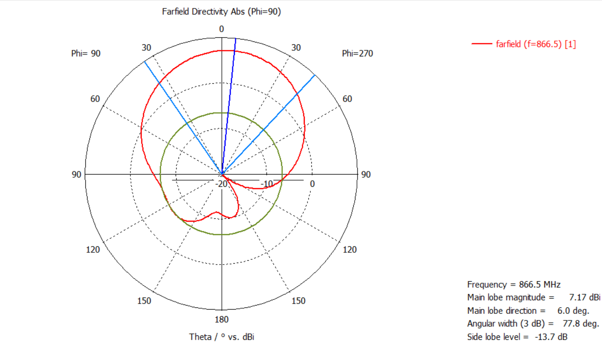

# UHF RFID Circularly Polarized Patch Antenna

## Circularly Polarized Patch Antenna Array for Vehicle Access Control

A CST Studio Suite based electromagnetic design of a circularly polarized UHF RFID patch antenna operating in the ETSI 865–868 MHz band.

The antenna is designed for vehicle access-control applications such as boom-barrier and lane-based RFID systems, where a focused radiation pattern is desirable to reduce unintended reads from adjacent lanes.

## Key Specifications

| Parameter | Value |
|---|---|
| Operating Band | 865–868 MHz |
| Center Frequency | 866.5 MHz |
| Antenna Type | Corner-truncated square patch |
| Polarization | Circular |
| Feed | Microstrip quarter-wave transformer |
| Substrate | Rogers RO4003C |
| Single Element Directivity | 7.165 dBi |
| 4-Element Array Directivity | 9.780 dBi |
| S11 at 866.5 MHz | −18.64 dB |
| VSWR at 866.5 MHz | 1.26 |
| Axial Ratio at 866.5 MHz | 2.60 dB |
| Side-lobe Level | −13.7 dB |

## Antenna Design

The design uses a square patch with two opposite corner truncations to generate circular polarization from a single feed.

A microstrip quarter-wave transformer is used for impedance matching.

The initial patch dimensions were obtained using the transmission-line model and subsequently optimized using CST electromagnetic simulation.

### Antenna Structure

### Top View

## Simulation Results

### S11

The simulated antenna maintains S11 below −17.7 dB across the 865–868 MHz operating band.

### VSWR

The simulated VSWR remains below 1.3 across the operating band.

### Axial Ratio

The axial ratio is 2.60 dB at the 866.5 MHz center frequency, demonstrating circular polarization at the design frequency.

## Radiation Characteristics

The single patch element provides approximately 7.165 dBi directivity at 866.5 MHz.

A four-element array increases the simulated directivity to approximately 9.780 dBi and produces a more focused radiation pattern.

### Single Element

### Array

### 2D Radiation Pattern

## Surface Current and Electric Field

### Surface Current

### Electric Field

## Design Parameters

## Applications

- UHF RFID vehicle identification
- Boom-barrier access control
- Lane-based vehicle access systems
- Directional RFID reader antennas
- Applications requiring reduced adjacent-lane tag reads

## Tools

- CST Studio Suite
- Electromagnetic simulation
- Parametric optimization
- Far-field and array analysis

## Documentation

The detailed design methodology, calculations, simulation results, and analysis are available in the project report.

[View the detailed project report](UHF_RFID_Patch_Antenna_Report(1).pdf)

## Author

**Arya**

Electronics and Communication Engineering

[GitHub](https://github.com/Aryaawe)
